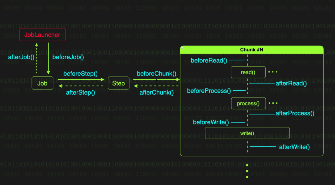

# Spring Batch Listener
- 리스너는 배치 처리의 주요 순간들을 관찰하고 각 시점에 필요한 동작을 정의할 수 있는 강력한 도구
- 배치 처리 중 발생하는 특정 이벤트를 감지하고 그에 대한 동작을 정의할 수 있게 해준다.
---
## JobExecutionListener
- Job 실행의 시작과 종료 시점에 호출되는 리스너 인터페이스
- Job 실행 결과를 이메일로 전송하거나, Job이 시작하기 전에 필요한 리소스를 준비하고 끝난 후에 정리하는 부가 작업을 수행할 수 있다.
```
public interface JobExecutionListener {
    default void beforeJob(JobExecution jobExecution) { }
    default void afterJob(JobExecution jobExecution) { }
}
```
- `afterJob()` 메서드는 잡 실행 정보가 메타데이터 저장소에 저장되기 전에 호출된다. 
- 이를 활용하면 특정 조건에 따라 Job의 실행 결과 상태를 완료(COMPLETED)에서 실패(FAILED)로 변경하거나, 그 반대로 변경하는 것도 가능하다.

## StepExecutionListener
- Step 실행의 시작과 종료 시점에 호출되는 리스너 인터페이스다. 
- Step의 시작 시간, 종료 시간, 처리된 데이터 수를 로그로 기록하는 등의 사용자 정의 작업을 추가할 수 있다.
```
public interface StepExecutionListener extends StepListener {
    default void beforeStep(StepExecution stepExecution) {
    }

    @Nullable
    default ExitStatus afterStep(StepExecution stepExecution) {
	return null;
    }
}
```
- `afterStep()` 메서드를 -> `ExitStatus`를 반환
- 이를 통해 `afterStep()`에서 특정 조건에 따라 Step의 실행 결과 상태를 직접 변경할 수 있다.

## ChunkListener
- ChunkListener는 하나의 청크 단위 처리가 시작되기 전, 완료된 후, 그리고 에러가 발생했을 때 호출되는 리스너 인터페이스다. 
- 각 청크의 처리 현황을 모니터링하거나 로깅하는데 사용할 수 있다.
```
public interface ChunkListener extends StepListener {
    default void beforeChunk(ChunkContext context) {
    }

    default void afterChunk(ChunkContext context) {
    }
	
    default void afterChunkError(ChunkContext context) {
    }
}
```
- `afterChunk()`는 트랜잭션이 커밋된 후에 호출된다. 
- 반면 청크 처리 도중 예외가 발생하면 `afterChunk()` 대신 `afterChunkError()`가 호출되는데, 이는 청크 트랜잭션이 롤백된 이후에 호출된다.

## Item[Read|Process|Write]Listener
- `ItemReadListener`와 `ItemProcessListener`, `ItemWriteListener`는 아이템의 읽기, 처리, 쓰기 작업이 수행되는 시점에 호출되는 리스너 인터페이스들이다.
- 각 리스너의 메서드는 아이템 단위의 처리 전후와 에러 발생 시점에 호출된다.
```
// ItemReadListener.java
public interface ItemReadListener<T> extends StepListener {
    default void beforeRead() { }
    default void afterRead(T item) { }
    default void onReadError(Exception ex) { }
}

// ItemProcessListener.java
public interface ItemProcessListener<T, S> extends StepListener {
    default void beforeProcess(T item) { }
    default void afterProcess(T item, @Nullable S result) { }
    default void onProcessError(T item, Exception e) { }
}

// ItemWriteListener.java
public interface ItemWriteListener<S> extends StepListener {
    default void beforeWrite(Chunk<? extends S> items) { }
    default void afterWrite(Chunk<? extends S> items) { }
    default void onWriteError(Exception exception, Chunk<? extends S> items) { }
}
```
- `ItemReadListener.afterRead()`는 `ItemReader.read()` 호출 후에 호출되지만, `ItemReader.read()` 메서드가 더 이상 읽을 데이터가 없어 null을 반환할 때는 호출되지 않는다.
- `ItemProcessListener.afterProcess()`는 `ItemProcessor.process()` 메서드가 null을 반환하더라도 호출된다. 
  - 참고로 ItemProcessor에서 null을 반환하는 것은 해당 데이터를 필터링하겠다는 의미다.
- `ItemWriteListener.afterWrite()`는 트랜잭션이 커밋되기 전, 그리고 `ChunkListener.afterChunk()`가 호출되기 전에 호출된다.
---
